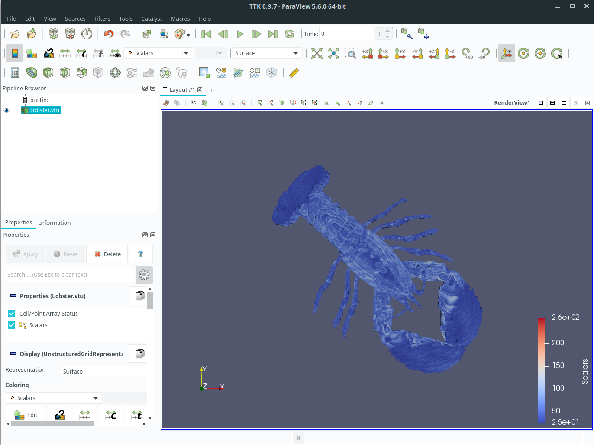
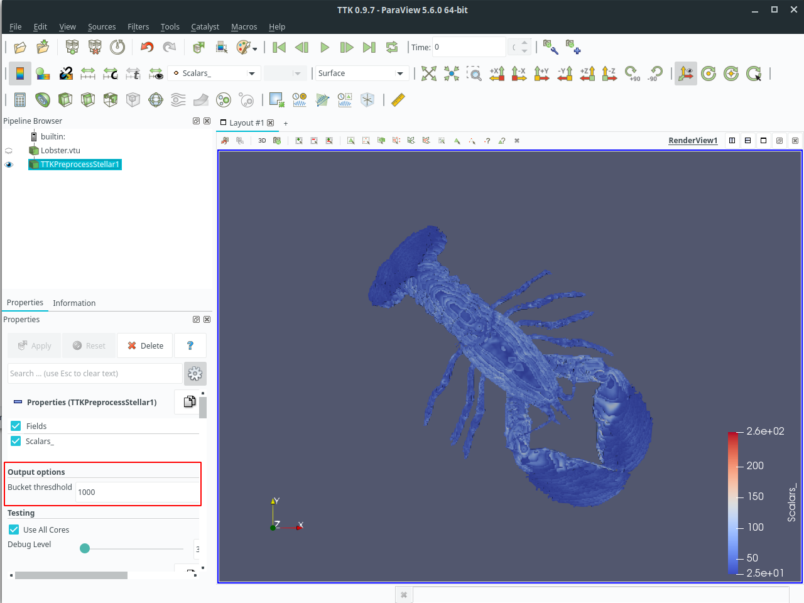
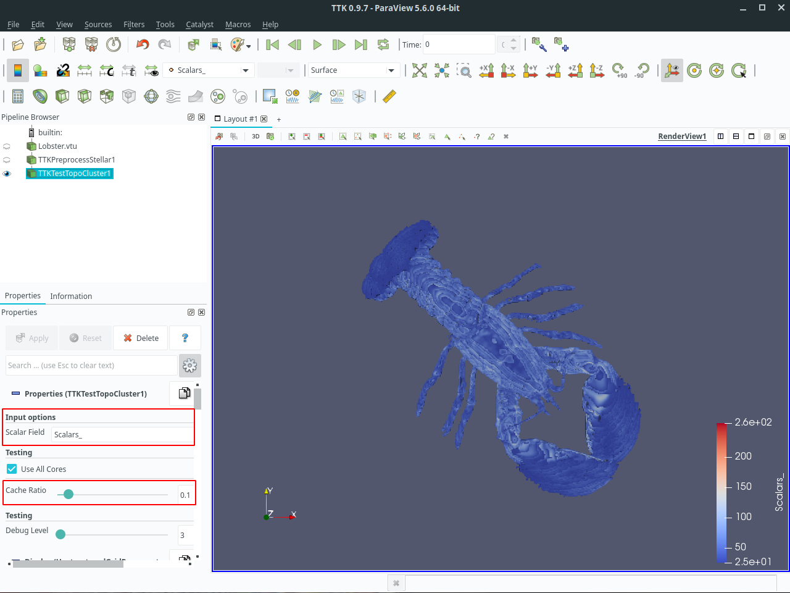
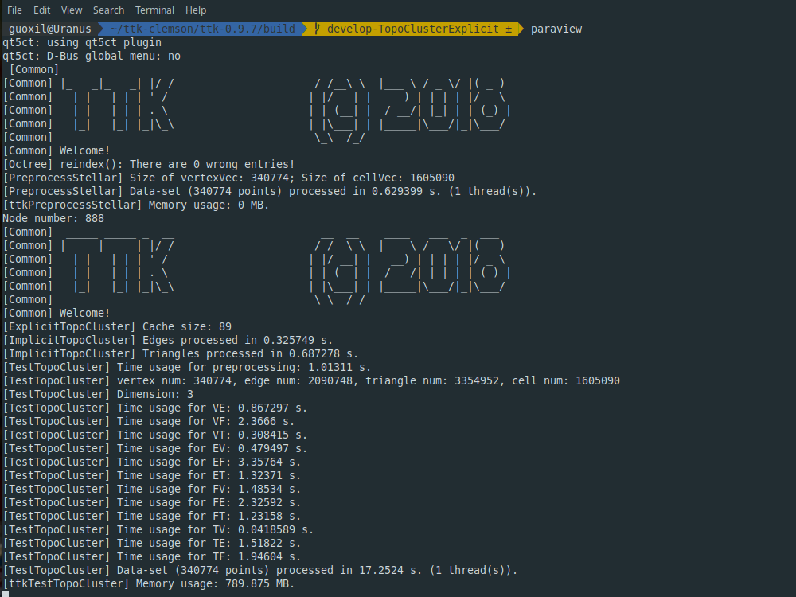

# TopoCluster

**Update**: TopoCluster is currently being integrated into the new version of TTK. Please check out the [new repository](https://github.com/guoxiliu/ttk) for development progress. 

This repository contains the implementation of TopoCluster, a new localized data structure for tetrahedral meshes, which provides efficient computation of the connectivity of the mesh elements with a low memory footprint. 

The data structure is discussed in the paper *TopoCluster: A Localized Data Structure for Topology-based Visualization* currently submitted for publication to *IEEE Transactions on Visualization and Computer Graphics*.

## Structure of repository

TopoCluster is developed on top of the [Topology Toolkit](https://topology-tool-kit.github.io/index.html) (TTK) framework which is integrated with [ParaView](https://www.paraview.org/) 

The repository contains the code used for the experimental section of our paper includeing the versions of Paraview and TTK.

- Folder `ParaView-v5.6.0` contains [ParaView](https://www.paraview.org/) version 5.6.0. The original source code can be downloaded from [here](https://www.paraview.org/download/).
- Folder `ttk-0.9.7` contains the [Topology Toolkit](https://topology-tool-kit.github.io/index.html) version 0.9.7 with only the plugins used in our experiments. The original version of TTK can be downloaded from [here](https://topology-tool-kit.github.io/downloads.html).
- Folder `Datasets` contains simple datasets that can be used to test TopoCluster.


## Installation

The following installation steps are based on [TTK offical installation guide](https://topology-tool-kit.github.io/installation-0.9.7.html) under Ubuntu Linux distribution. TopoCluster has been tested under Ubuntu and MacOS.


### 1. Downloads
Use `git clone` to clone the repository.

### 2. Installing the dependencies
Please enter the following commands (omit the `$` character) in a terminal to install dependencies.

```
$ sudo apt-get install cmake-qt-gui
$ sudo apt-get install libvtk7-dev
$ sudo apt-get install qt5-default qttools5-dev libqt5x11extras5-dev
```
### 3. Configuring, building and installing ParaView
Use `cd` command to change the current working directory to the project root when executing the following commands! 

#### Configuration 
To enter the configuration menu of ParaView's build, enter the following commands:

```
$ cd ./ParaView-v5.6.0/
$ mkdir build
$ cd build
$ cmake-gui ../
```

Click on the "Configure" button to proceed. Once the configuration is finished, please tick the "Advanced" check box and set the following variables as follows (required for TTK's installation):
- `CMAKE_BUILD_TYPE=Release`
- `PARAVIEW_ENABLE_PYTHON=ON`
- `PARAVIEW_INSTALL_DEVELOPMENT_FILES=ON`
- `VTK_PYTHON_VERSION=3`

Next, click on the "Generate" button and close the configuration window when the generation is completed.

#### Build 
Use `make -jN` command to start the compilation process, when `N` is the number of available cores on your system (this will take a **LONG** time).

#### Installation
Use `sudo make install` to install the build of ParaView on your system. 

### 4. Configuring, building and installing TTK
Use `cd` command to change the current working directory to the project root when executing the following commands! 

#### Configuration
To enter the configuration menu of ParaView's build, enter the following commands:

```
$ cd ./ttk-0.9.7/
$ mkdir build
$ cd build
$ cmake-gui ../
```

Click on the "Configure" button to proceed. Then, click on the "Generate" button. Once the generation is completed, close the configuration window.

As discussed in the paper, TopoCluster provides two instances. Explicit TopoCluster prioritizes time efficiency and provides only a modest savings in memory usage, while Implicit TopoCluster drastically reduces memory consumption up to an order of magnitude at the cost of time efficiency. 

Note: You can choose to build Explicit TopoCluster by setting `ENABLE_IMPLICIT_TOPOCLUSTER` to `OFF` (default) and to build Implicit TopoCluster by setting `ENABLE_IMPLICIT_TOPOCLUSTER` to `ON`. The parallel version can be built by selecting `TTK_ENABLE_OPENMP` checkbox.

#### Build 
Use `make -jN` command to start the compilation process, when `N` is the number of available cores on your system (this will take a **LONG** time).

#### Installation
Once the build is finished, use `sudo make install` to install your build of TTK on your system. After this, you have successfully installed TopoCluster.


## Quick start

To use TopoCluster structure, the input dataset needs to contain a scalar field named "**_index**" which denotes the cluster index of each point in the dataset. 

If the scalar field "**_index**" is found, TopoCluster will be automatically used at runtime.  You can define "**_index**" based on any application dependent criterion. 

In this repository, we provide a plugin called `ttkPreprocessStellar` that will originate "**_index**" based on Point Region (PR) octree. The only input parameter required by `ttkPreprocessStellar` is the maximum number of vertices per leaf node which will be used to build the Point Region (PR) octree.

In `Datasets` folder, we provide the original tetrahedral mesh of the lobster dataset (`Lobster.vtu`) and the one with the indexing field computed (`Lobster_1000.vtu`).

### Step-by-step example

1. Open ParaView in the terminal by using `paraview` command. Load the lobster dataset by selecting `File -> Open` and choosing `Lobster.vtu` in `Datasets`.


2. Select `Lobster.vtu` in `Pipeline Browser`, use shortcut `Ctrl + Space` to search the plugin `TTK PreprocessStellar` and press `Enter` to select. (Another option is through `Filters -> TTK - Misc -> TTK PreprocessStellar`.) The bucket threshold for the PR octree can be configured in the Properties panel of the plugin.


3. After preprocessing the dataset, you can select `TTKPreprocessStellar1` in `Pipeline Browser`, and apply any plugin provided by TTK. 
   
4. The plugin `TTK TestTopoCluster` is the one we used in our paper to test the performance of TopoCluster in extracting relational operators in bulk. To run the plugin, make sure the `Scalar Field` selected in the property panel is the desired scalar field other than `_index`. The `cache ratio` parameter defines the percentage of cluster that will be stored in cache at runtime; 0 corresponds to saving no cluster in cache; 1 corresponds to saving all clusters in cache.


1. Check the output from the terminal. The plugin should print out the time usage for each relational operator and the memory usage for the computation.

