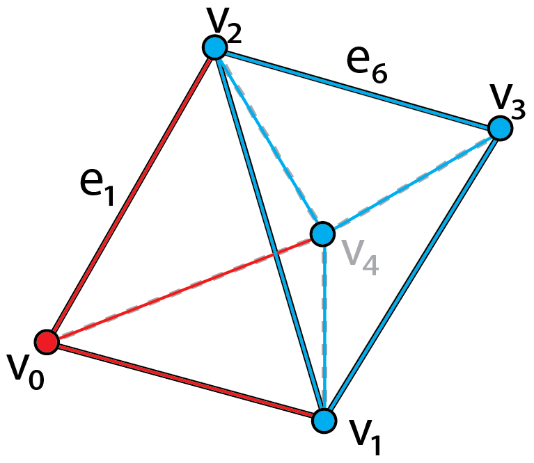
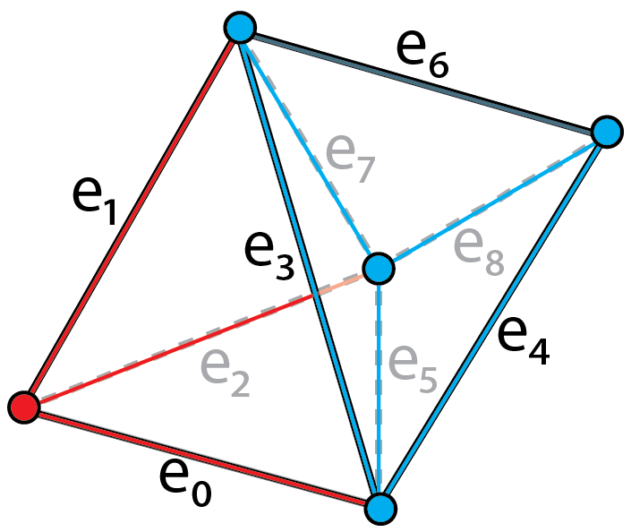
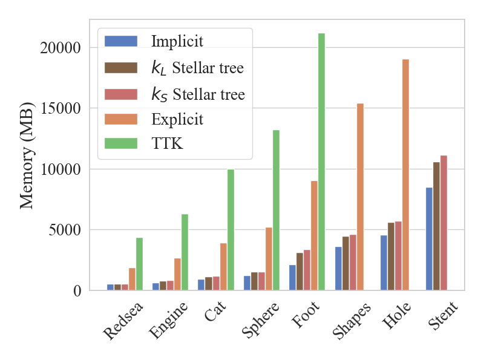
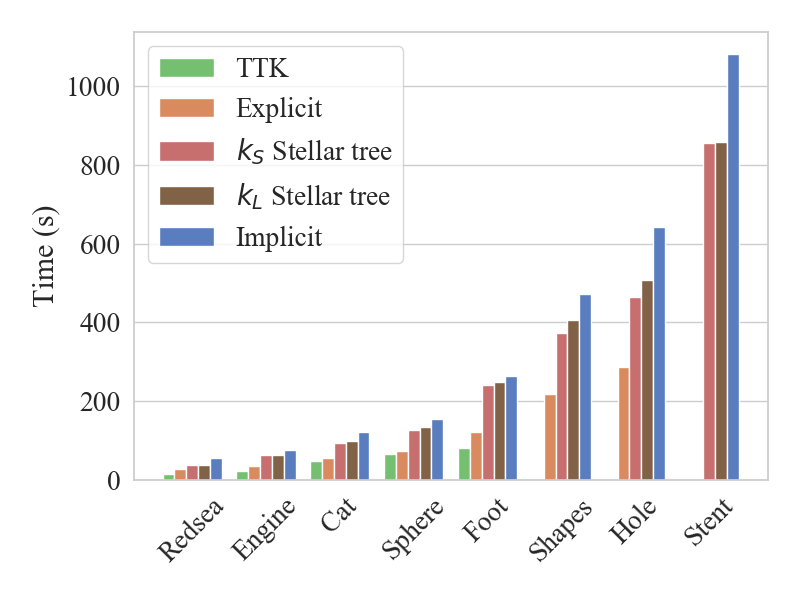
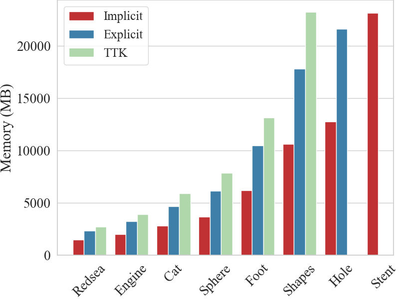
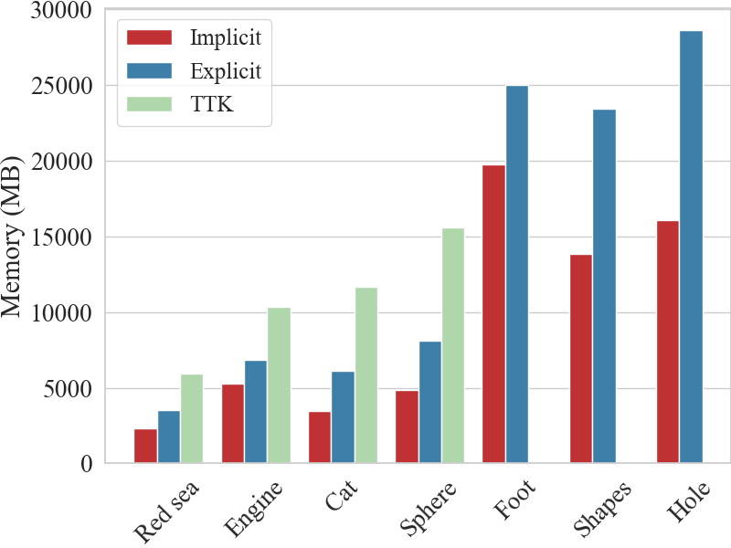
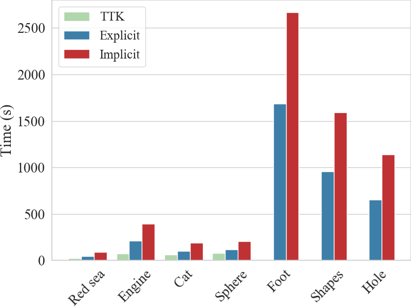

[Link to the paper](https://doi.org/10.1109/TVCG.2021.3121229)

## Introduction
Unstructured data are collections of points with irregular topology, often represented through simplicial meshes, such as triangle and tetrahedral meshes. Whenever possible such representations are avoided in visualization since they are computationally demanding if compared with regular grids. In this work, we aim at simplifying the encoding and processing of simplicial meshes. 

In the paper, we proposes TopoCluster, a new localized data structure for tetrahedral meshes, which can provide efficient computation of the connectivity of the mesh elements with a low memory footprint. 

There are two instances of TopoCluster: 
- Explicit TopoCluster prioritizes time efficiency and provides only a modest saving in memory
- Implicit TopoCluster drastically reduces memory consumption up to an order of magnitude with respect to comparable data structures. 

## TopoCluster 
TopoCluster inherits the localized approach for extracting relational operators from the Stellar decomposition, but aims at enumerating all the simplices of the simplicial complex through an _enumeration schema_. 

**Cluster-based enumeration.** 

 |  
:-------------------------|:-------------------------
*Tetrahedral mesh is formed by two clusters which are distinguished by red and blue separately. The vertices and edges are subdivided accordingly.*  |  *Enumeration of the edges of the tetrahedral mesh.*

The cluster-based enumeration is obtained by enforcing the following rules:
- k-simplices internal to a cluster c are enumerated within a closed interval [l, u], where u - l + 1 is the number of k-simplices internal to c;
- For any pair of clusters, the corresponding intervals do not overlap. As a consequence, for any pair of clusters c_i , c_j , with i < j, k-simplices in c_j have indices greater than those in c_i .

### Explicit TopoCluster
The global layer of Explicit TopoCluster includes the input tetrahedral mesh, the input subdivision, the enumeration schema, and the list of simplices intersecting each cluster defined in the input subdivision.

### Implicit TopoCluster

## Results

### Computing Relational Operators

Memory Comparison             |  Timing Comparison
:-------------------------:|:-------------------------:
  |  

### Computing Scalar Field Critical Points

Memory Comparison             |  Timing Comparison
:-------------------------:|:-------------------------:
  |  

### Computing Morse Smale Complex

Memory Comparison             |  Timing Comparison
:-------------------------:|:-------------------------:
  |  
